# Arquitectura Modular del Sistema (CalorieBalance)

Documentación técnica y mapa de componentes del proyecto, formateado para visualización directa en **Obsidian** y lectores de Markdown con soporte para diagramas **Mermaid**.

---

## 1. Diagrama de Arquitectura Modular (Mermaid)

```mermaid
graph TD
    subgraph APP["📱 Punto de Entrada"]
        App["App.tsx\n(Orquestador Principal)"]
    end

    subgraph FRONTEND["🎨 Capa Frontend (src/frontend)"]
        subgraph SCREENS["Pantallas Verticales"]
            DailyScreen["DailyLogScreen\n(Carga Diaria)"]
            HistoryScreen["HistoryScreen\n(Historial & Pasados)"]
            ChartsScreen["ChartsScreen\n(Gráficos & Tendencias)"]
        end

        subgraph COMPONENTS_COMMON["Componentes Comunes"]
            Header["Header\n(Barra Superior & Estado)"]
            BottomNav["BottomNav\n(Barra de Pestañas)"]
            Toast["Toast\n(Feedback Flotante)"]
        end

        subgraph COMPONENTS_UI["Componentes Estandarizados (UI)"]
            Card["Card\n(Elevated / Flat / Low)"]
            StatusBadge["StatusBadge\n(Déficit / Superávit)"]
            Button["Button\n(Primary / Tonal / Outline)"]
        end

        subgraph COMPONENTS_METRICS["Componentes de Métricas"]
            BentoSummary["BentoSummary\n(3 Cards: Umbral / Consumo / Déficit)"]
            ProgressBar["ProgressBar\n(Barra con Umbral)"]
        end

        subgraph THEME["Design Tokens"]
            Colors["theme/colors.ts\n(Paleta Stitch Pastel)"]
            Spacing["theme/spacing.ts\n(Espaciado & Radios)"]
        end
    end

    subgraph BACKEND["⚙️ Capa Lógica & Servicios (src/backend)"]
        CalorieCalc["CalorieCalculator\n(Fórmulas de Déficit & Agregaciones)"]
        AIService["AIService\n(Gemini 1.5 Flash & Heurísticas)"]
        SyncService["SyncService\n(Sincronización Supabase Cloud)"]
        AIPrompts["prompts.ts\n(System Prompts Nutricionales)"]
    end

    subgraph DATA["💾 Capa de Persistencia (src/data)"]
        subgraph REPOSITORIES["Repositorios (CRUD)"]
            DailyRepo["DailyLogRepository"]
            MealRepo["MealEntryRepository"]
            SettingsRepo["SettingsRepository"]
        end

        subgraph LOCAL_DB["Motor Local"]
            SQLite["SQLite Driver\n(expo-sqlite)"]
            TablesDDL["tables.ts\n(Esquema DDL Relacional)"]
            SeedData["seedData.ts\n(Semillas de Prueba)"]
        end
    end

    subgraph TYPES["📐 Capa de Tipos (src/types)"]
        DomainTypes["domain.ts\n(DailyLog, MealEntry, Settings)"]
        NavTypes["navigation.ts\n(ScreenType, PeriodType)"]
    end

    %% Relaciones de Flujo
    App --> Header
    App --> BottomNav
    App --> DailyScreen
    App --> HistoryScreen
    App --> ChartsScreen
    App --> SQLite

    DailyScreen --> Card
    DailyScreen --> Button
    DailyScreen --> StatusBadge
    DailyScreen --> BentoSummary
    DailyScreen --> ProgressBar
    DailyScreen --> Toast
    DailyScreen --> DailyRepo
    DailyScreen --> CalorieCalc
    DailyScreen --> AIService

    HistoryScreen --> Card
    HistoryScreen --> Button
    HistoryScreen --> StatusBadge
    HistoryScreen --> Toast
    HistoryScreen --> DailyRepo
    HistoryScreen --> CalorieCalc
    HistoryScreen --> AIService

    ChartsScreen --> Card
    ChartsScreen --> StatusBadge
    ChartsScreen --> DailyRepo
    ChartsScreen --> CalorieCalc

    Header --> StatusBadge
    BentoSummary --> CalorieCalc
    ProgressBar --> CalorieCalc
    AIService --> AIPrompts

    DailyRepo --> SQLite
    MealRepo --> SQLite
    SettingsRepo --> SQLite
    SyncService --> DailyRepo

    SQLite --> TablesDDL
    SQLite --> SeedData

    FRONTEND -.-> TYPES
    BACKEND -.-> TYPES
    DATA -.-> TYPES
    FRONTEND -.-> THEME
```

---

## 2. Estandarización Transversal del Frontend

Para mantener cohesión y evitar inconsistencias visuales en el desarrollo modular:

| Componente | Ubicación | Propósito y Reglas |
| :--- | :--- | :--- |
| **`Card`** | `@frontend/components/ui/Card.tsx` | Contenedor transversal para todas las secciones (`elevated`, `flat`, `low`). Aplica elevación suave y bordes redondeados consistentes (`24px`). |
| **`StatusBadge`** | `@frontend/components/ui/StatusBadge.tsx` | Indicador unificado de estado calórico: Verde Salvia (`#4b635a`) para déficit y Coral/Terracota (`#7f5040`) para superávit. Usado en Header, Daily, History y Charts. |
| **`Button`** | `@frontend/components/ui/Button.tsx` | Botón estándar con variantes (`primary`, `secondary`, `tonal`, `outline`), iconos automáticos y estado de carga (`loading`). |
| **`BentoSummary`** | `@frontend/components/metrics/BentoSummary.tsx` | Micro-bento de 3 tarjetas (Umbral, Consumo y Balance). |
| **`ProgressBar`** | `@frontend/components/metrics/ProgressBar.tsx` | Indicador de barra de progreso con marcador exacto en el umbral objetivo. |

---

## 3. Desacoplamiento de Lógica de Negocio (`src/backend/`)

- **`CalorieCalculator`**: Aísla todas las matemáticas y fórmulas (diferencias, porcentajes, cálculo de promedios semanales y porcentajes de días en meta). Si mañana cambian los umbrales o fórmulas, no se modifica la UI.
- **`AIService`**: Encapsula el cliente de Gemini y las reglas de parsing.
- **`SyncService`**: Encapsula el cliente REST para sincronizar con Supabase sin tocar los repositorios locales.

---

## 4. Capa de Datos Agnóstica (`src/data/`)

Los componentes de la interfaz de usuario nunca escriben consultas SQL directas ni acceden a SQLite. Toda interacción ocurre a través de los **Repositorios**:
- `DailyLogRepository`
- `MealEntryRepository`
- `SettingsRepository`

Esto garantiza que la migración o sincronización con **Supabase** sea transparente.
