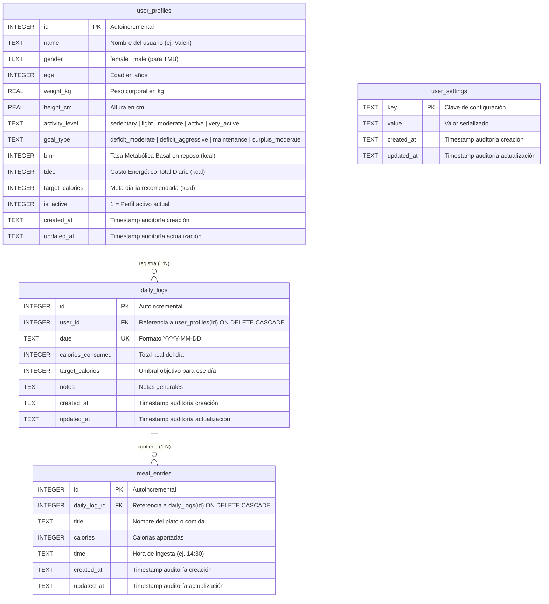

# Diccionario de Datos Relacional (SQLite & Supabase)

Especificación técnica del modelo relacional implementado en la aplicación, compatible 1:1 entre el motor local **SQLite (`expo-sqlite`)** y **PostgreSQL en Supabase**.

> [!IMPORTANT]
> **Regla Permanente de Auditoría**: Todas las tablas y entidades del sistema deben incluir obligatoriamente los campos de auditoría `created_at` y `updated_at` en formato ISO 8601 UTC.

---

## 1. Diagrama Entidad-Relación (Mermaid)



---

## 2. Definiciones DDL Oficiales

### Tabla `user_profiles`
```sql
CREATE TABLE IF NOT EXISTS user_profiles (
  id INTEGER PRIMARY KEY AUTOINCREMENT,
  name TEXT NOT NULL,
  gender TEXT NOT NULL,
  age INTEGER NOT NULL,
  weight_kg REAL NOT NULL,
  height_cm REAL NOT NULL,
  activity_level TEXT NOT NULL,
  goal_type TEXT NOT NULL,
  bmr INTEGER NOT NULL,
  tdee INTEGER NOT NULL,
  target_calories INTEGER NOT NULL,
  is_active INTEGER NOT NULL DEFAULT 1,
  created_at TEXT NOT NULL,
  updated_at TEXT NOT NULL
);
```

### Tabla `daily_logs`
```sql
CREATE TABLE IF NOT EXISTS daily_logs (
  id INTEGER PRIMARY KEY AUTOINCREMENT,
  user_id INTEGER,
  date TEXT NOT NULL UNIQUE,
  calories_consumed INTEGER NOT NULL DEFAULT 0,
  target_calories INTEGER NOT NULL DEFAULT 1800,
  notes TEXT,
  created_at TEXT NOT NULL,
  updated_at TEXT NOT NULL,
  FOREIGN KEY (user_id) REFERENCES user_profiles(id) ON DELETE CASCADE
);
```

### Tabla `meal_entries`
```sql
CREATE TABLE IF NOT EXISTS meal_entries (
  id INTEGER PRIMARY KEY AUTOINCREMENT,
  daily_log_id INTEGER NOT NULL,
  title TEXT NOT NULL,
  calories INTEGER NOT NULL,
  time TEXT,
  created_at TEXT NOT NULL,
  updated_at TEXT NOT NULL,
  FOREIGN KEY (daily_log_id) REFERENCES daily_logs(id) ON DELETE CASCADE
);
```

### Tabla `user_settings`
```sql
CREATE TABLE IF NOT EXISTS user_settings (
  key TEXT PRIMARY KEY,
  value TEXT NOT NULL,
  created_at TEXT NOT NULL,
  updated_at TEXT NOT NULL
);
```
