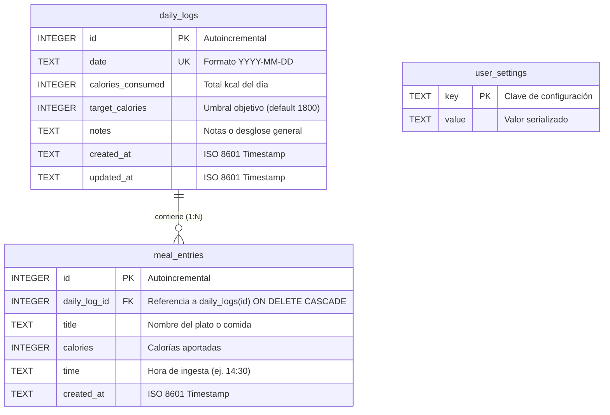

# Diccionario de Datos Relacional (SQLite & Supabase)

Especificación técnica del modelo relacional implementado en la aplicación, compatible 1:1 entre el motor local **SQLite (`expo-sqlite`)** y **PostgreSQL en Supabase**.

---

## 1. Diagrama Entidad-Relación (Mermaid)



---

## 2. Definiciones DDL

### Tabla `daily_logs`
```sql
CREATE TABLE IF NOT EXISTS daily_logs (
  id INTEGER PRIMARY KEY AUTOINCREMENT,
  date TEXT NOT NULL UNIQUE,
  calories_consumed INTEGER NOT NULL DEFAULT 0,
  target_calories INTEGER NOT NULL DEFAULT 1800,
  notes TEXT,
  created_at TEXT NOT NULL,
  updated_at TEXT NOT NULL
);
```

### Tabla `meal_entries`
```sql
CREATE TABLE IF NOT EXISTS meal_entries (
  id INTEGER PRIMARY KEY AUTOINCREMENT,
  daily_log_id INTEGER NOT NULL,
  title TEXT NOT NULL,
  calories INTEGER NOT NULL,
  time TEXT,
  created_at TEXT NOT NULL,
  FOREIGN KEY (daily_log_id) REFERENCES daily_logs(id) ON DELETE CASCADE
);
```

### Tabla `user_settings`
```sql
CREATE TABLE IF NOT EXISTS user_settings (
  key TEXT PRIMARY KEY,
  value TEXT NOT NULL
);
```
